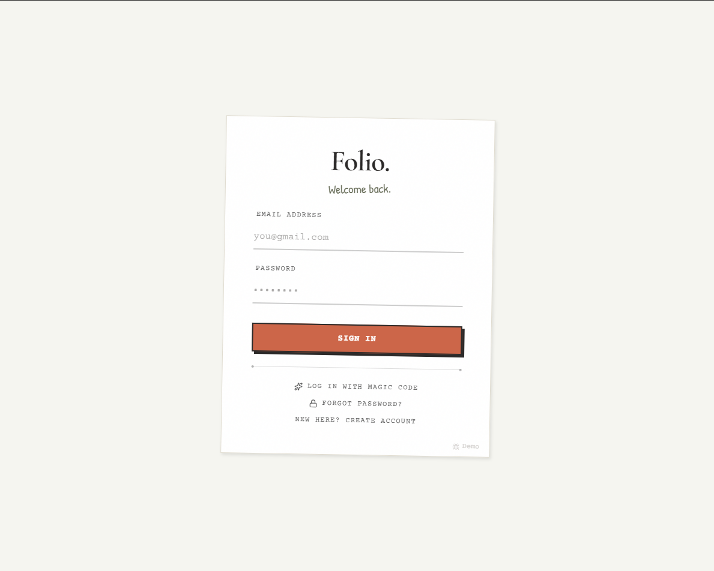
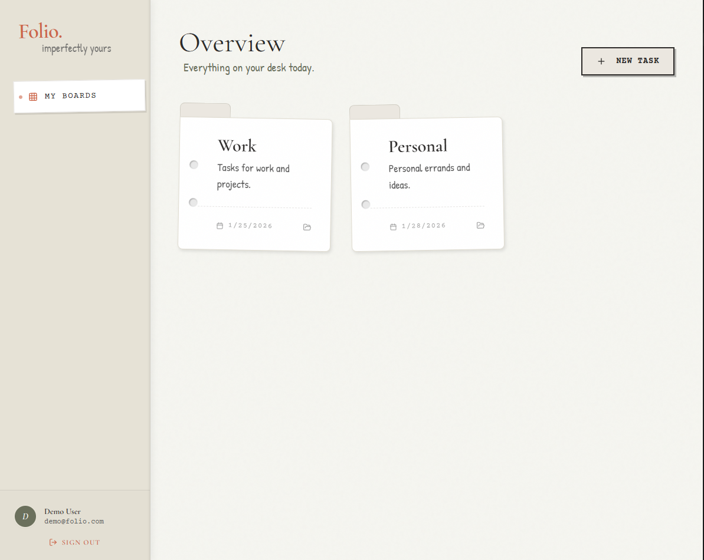
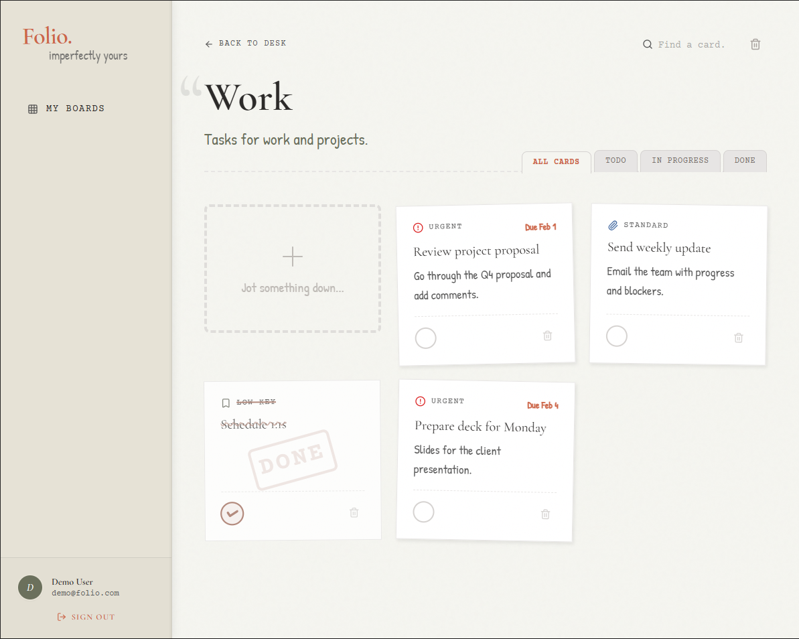

# Folio – To-Do App

A full-stack to-do application with a paper-and-desk aesthetic. Create boards (task lists), add tasks with priorities and due dates, and sign in with password or OTP. Includes a **demo mode** with sample data and no database.

> **Screenshots:** Add `login.png`, `dashboard.png`, and `board-tasks.png` to `docs/screenshots/` after running the app to see the app previews below.

---

## Table of Contents

- [Features](#features)
- [Tech Stack](#tech-stack)
- [Prerequisites](#prerequisites)
- [Quick Start](#quick-start)
- [Environment Variables](#environment-variables)
- [Running Locally (Detailed)](#running-locally-detailed)
- [API Overview](#api-overview)
- [Project Structure](#project-structure)
- [Screenshots](#screenshots)

---

## Features

- **Authentication**
  - Sign in with **email + password** or **magic code (OTP)**
  - **Registration** with email verification via OTP
  - **Reset password** via OTP to your email
  - **Demo mode** – try the app with sample data, no account or database

- **Boards & Tasks**
  - Create multiple **boards** (collections)
  - Add **tasks** with title, description, priority (Low / Medium / High), due date, and status (Todo / In Progress / Done)
  - Filter by status (All / Todo / In Progress / Done) and search by title/description
  - Edit or delete tasks; mark complete from the card or in the edit modal

- **UI**
  - Paper-style theme (Folio branding)
  - Responsive layout
  - Registration banner in demo mode after ~45 seconds

---

## Tech Stack

| Layer    | Technology |
| -------- | ---------- |
| Frontend | React 19, TypeScript, Vite 6, Tailwind (CDN), Lucide React |
| Backend  | Python 3, FastAPI, Motor (async MongoDB), Pydantic |
| Database | MongoDB |
| Auth     | JWT (Bearer), bcrypt, OTP via email (e.g. Gmail SMTP) |

---

## Prerequisites

- **Node.js** 18+ and **npm**
- **Python** 3.10+
- **MongoDB** (local instance or MongoDB Atlas)
- (Optional) **Gmail** with App Password for OTP and reset-password emails

---

## Quick Start

1. **Clone and install**
   ```bash
   cd to-do-app-version
   npm install
   cd backend && pip install -r requirements.txt && cd ..
   ```

2. **Configure backend**
   - Copy `backend/.env.example` to `backend/.env`
   - Set `MONGODB_URL`, `DB_NAME`, `SECRET_KEY`; optionally Gmail for OTP/reset

3. **Run**
   - Terminal 1 (backend): `cd backend && python -m uvicorn main:app --reload --host 0.0.0.0 --port 8000`
   - Terminal 2 (frontend): `npm run dev`
   - Open **http://localhost:3000**

4. **Try without backend**
   - Click **Demo** on the login page to use sample data only (no API, no DB).

---

## Environment Variables

### Backend (`backend/.env`)

| Variable | Description | Example |
| -------- | ----------- | ------- |
| `MONGODB_URL` | MongoDB connection string | `mongodb://localhost:27017` or Atlas URI |
| `DB_NAME` | Database name | `folio_db` |
| `SECRET_KEY` | JWT signing key (min 32 chars) | Long random string |
| `ALGORITHM` | JWT algorithm | `HS256` |
| `ACCESS_TOKEN_EXPIRY_MINUTES` | Token lifetime | `10080` (7 days) |
| `OTP_EXPIRY_MINUTES` | OTP validity | `10` |
| `GMAIL_EMAIL` | Sender for OTP/reset emails | Your Gmail |
| `GMAIL_APP_PASSWORD` | Gmail App Password | 16-char app password |
| `SMTP_SERVER` | SMTP host | `smtp.gmail.com` |
| `SMTP_PORT` | SMTP port | `587` |

**Gmail setup (for OTP / reset password):**  
Enable 2FA → Google Account → Security → App passwords → Generate for “Mail” and paste into `GMAIL_APP_PASSWORD` (no spaces).

### Frontend (optional)

Create `.env` or `.env.local` in the project root if the API is not on localhost:

| Variable | Description | Default |
| -------- | ----------- | ------- |
| `VITE_API_URL` | Backend base URL | `http://localhost:8000` |

---

## Running Locally (Detailed)

### 1. Clone the repository

```bash
git clone <repository-url>
cd to-do-app-version
```

### 2. Backend setup

```bash
cd backend
```

- Create a virtual environment (recommended):
  ```bash
  python -m venv venv
  # Windows
  venv\Scripts\activate
  # macOS/Linux
  source venv/bin/activate
  ```

- Install dependencies:
  ```bash
  pip install -r requirements.txt
  ```

- Copy environment file and edit:
  ```bash
  copy .env.example .env   # Windows
  # cp .env.example .env   # macOS/Linux
  ```
  Set at least `MONGODB_URL`, `DB_NAME`, and `SECRET_KEY`.

- Start the API server:
  ```bash
  python -m uvicorn main:app --reload --host 0.0.0.0 --port 8000
  ```
  API will be at **http://localhost:8000**. Docs: **http://localhost:8000/docs**.

### 3. Frontend setup

Open a **new terminal** in the project root:

```bash
cd to-do-app-version   # if not already there
npm install
npm run dev
```

Frontend will be at **http://localhost:3000**.

### 4. Use the app

- **Register:** Create account → enter name, email, password → “Send verification code” → enter OTP → “Verify & create account”.
- **Sign in:** Email + password, or “Log in with Magic Code” and verify OTP.
- **Demo:** Click “Demo” to use sample boards and tasks without an account or database; data resets each time you open Demo again.
- **Reset password:** “Forgot password?” → enter email → enter OTP and new password.

---

## API Overview

| Method | Endpoint | Description |
| ------ | -------- | ----------- |
| POST | `/token` | Login (email + password), returns JWT |
| POST | `/auth/register-request` | Start registration (sends OTP) |
| POST | `/auth/register-verify` | Finish registration (OTP + create user) |
| POST | `/auth/request-otp` | Request login OTP |
| POST | `/auth/verify-otp` | Verify OTP and sign in (or create OTP-only user) |
| POST | `/auth/request-reset-password` | Request reset OTP |
| POST | `/auth/reset-password` | Set new password with OTP |
| GET | `/users/me` | Current user (Bearer token) |
| GET | `/boards` | List boards |
| POST | `/boards` | Create board |
| DELETE | `/boards/{id}` | Delete board |
| GET | `/boards/{id}/tasks` | List tasks for board |
| POST | `/tasks` | Create task |
| PUT | `/tasks/{id}` | Update task |
| DELETE | `/tasks/{id}` | Delete task |

---

## Project Structure

```
to-do-app-version/
├── backend/
│   ├── main.py           # FastAPI app, auth, boards, tasks
│   ├── requirements.txt
│   └── .env.example
├── components/
│   ├── EditTaskModal.tsx
│   ├── Layout.tsx
│   ├── TaskItem.tsx
│   └── ui/
│       └── LayoutElements.tsx
├── pages/
│   ├── BoardView.tsx     # Single board + task list
│   ├── Dashboard.tsx     # Board list
│   └── Login.tsx         # Auth (login, register, OTP, reset)
├── services/
│   └── mockService.ts    # API client
├── contexts.ts           # Auth + demo state
├── demoData.ts           # Seed data for demo mode
├── types.ts
├── App.tsx
├── index.tsx
├── index.html
├── vite.config.ts
├── package.json
└── README.md
```

---

## Screenshots

1. Run the app locally (see [Quick Start](#quick-start) or [Running Locally](#running-locally-detailed)).
2. Open **http://localhost:3000** and sign in (or use Demo).
3. Capture screenshots and save them in `docs/screenshots/` as:

| File | What to capture |
|------|-----------------|
| `login.png` | Login/registration page (password, OTP, register, Demo) |
| `dashboard.png` | Dashboard with at least one board visible |
| `board-tasks.png` | A board open with task cards, filters, and search bar |

The README will then show these images in the sections below.

### Login & Registration

Login screen with options for **password**, **magic code (OTP)**, and **registration**. The **Demo** button opens the app with sample data only (no database).

<!-- Add docs/screenshots/login.png -->


### Dashboard (Boards)

Overview of your **boards** (task lists). Create new boards and click one to open its tasks.

<!-- Add docs/screenshots/dashboard.png -->


### Board View (Tasks)

Tasks on a board: **filters** (All / Todo / In Progress / Done), **search**, and add/edit/delete. Cards show priority, due date, and completion (mark done from card or edit modal).

<!-- Add docs/screenshots/board-tasks.png -->


---

## License

Private / project use.
